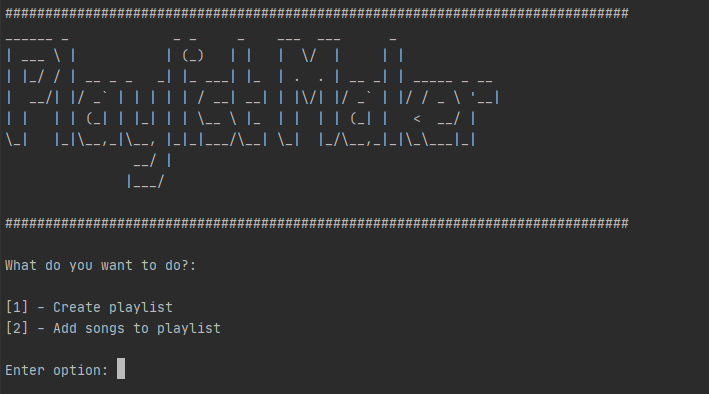

# Spotify-Playlist-Maker
Spotify playlist maker made with python using Spotipy

## **Usage**

Run the following command on the console:

```python playlistmaker.py```

You'll be asked what option you want to choose: create a new playlist or add songs to a existing one. The program is pretty easy to follow.



## **Requeriments**

* certifi==2020.6.20
* chardet==3.0.4
* idna==2.10
* progress==1.5
* pyfiglet==0.8.post1
* requests==2.24.0
* six==1.15.0
* spotipy==2.15.0
* urllib3==1.25.10

## **To do**

* Improve/Refactoring code
* Add more error handling
* Don't let the user add a song that's already in the playlist 
